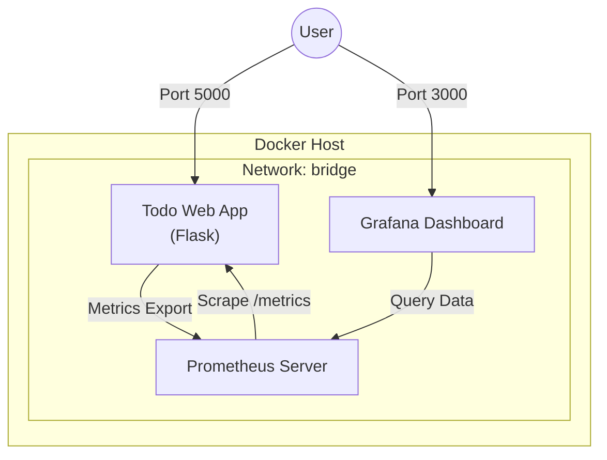
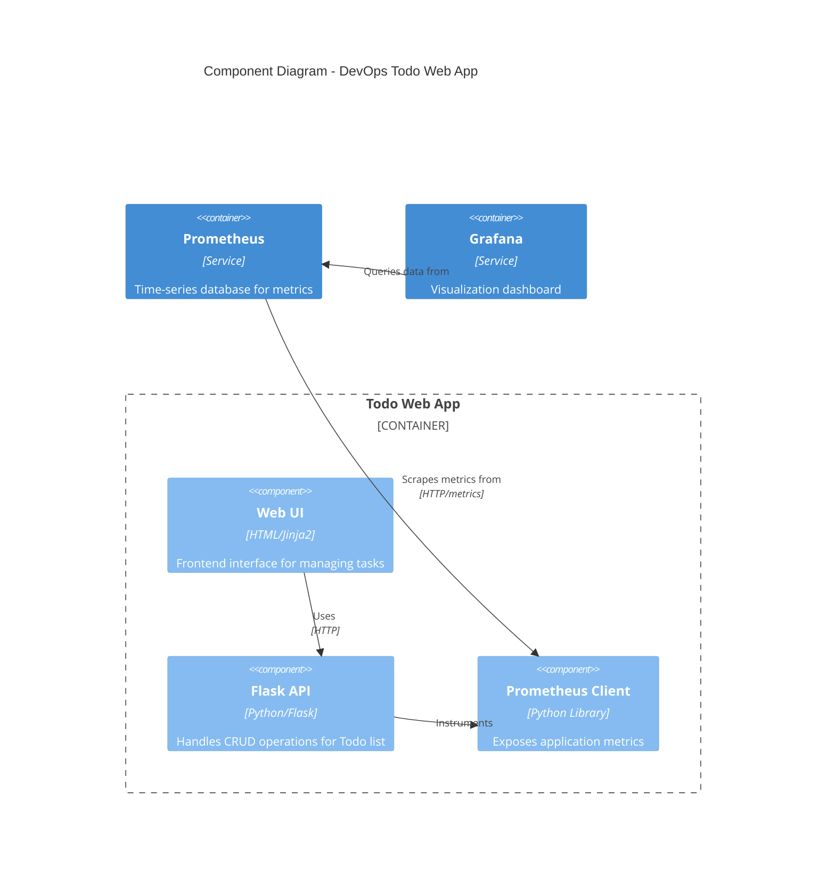
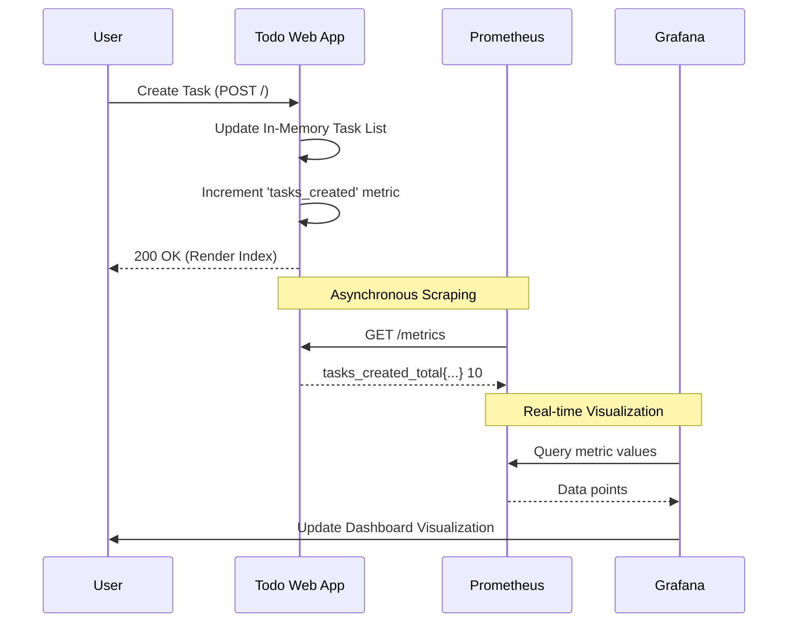

# DevOps Todo Project

This is a complete DevOps project demonstrating a full pipeline for a Python Flask web application.

[**View Repository on GitHub**](https://github.com/DEVENDRA4774/DevOps-Todo-Web-App)

## Tool Stack
- **Git & GitHub**: Version Control
- **GitHub Actions**: CI/CD Pipeline
- **Docker**: Containerization
- **Terraform**: Infrastructure as Code (IaC)
- **Ansible**: Configuration Management
- **Prometheus & Grafana**: Monitoring & Metrics

## Project Structure
```text
devops-todo-project/
├── app/
│   ├── app.py          (Flask app)
│   ├── templates/      (HTML templates)
│   ├── tests/          (Pytest tests)
│   └── requirements.txt
├── Dockerfile
├── docker-compose.yml
├── .github/
│   └── workflows/
│       └── ci-cd.yml
├── terraform/
│   └── main.tf
├── ansible/
│   ├── playbook.yml
│   └── inventory
├── monitoring/
│   ├── prometheus.yml
│   └── grafana/
└── README.md
```
## Project Diagrams

### 1. Deployment Diagram (The "DevOps" View)
This diagram illustrates the containerized deployment environment on the Docker host.



### 2. Component Diagram (The "Architecture" View)
This view shows the internal logic and integration points between the application and the monitoring stack.



### 3. Sequence Diagram (The "Process" View)
This diagram traces the flow of a user interaction and how it is observed by the monitoring system.


